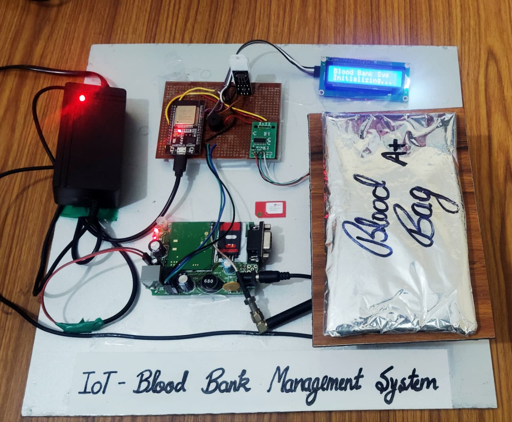
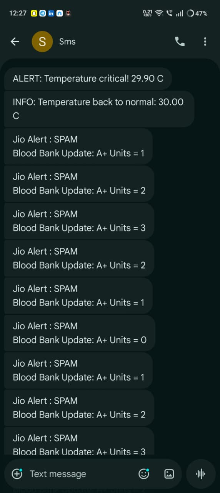
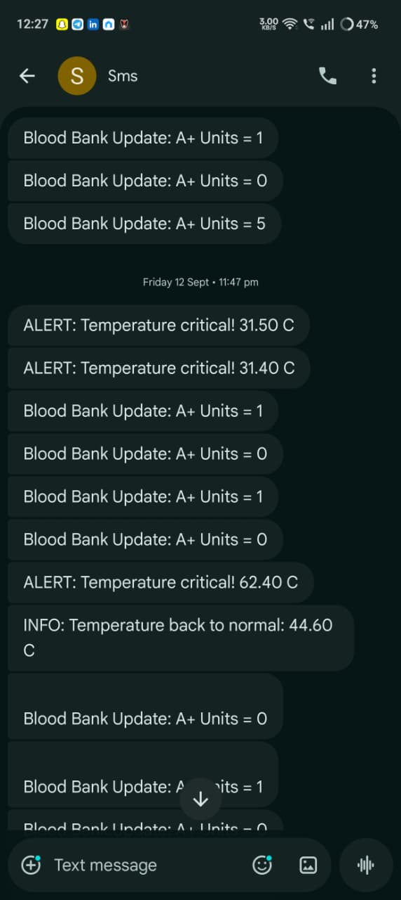

# 🩸 Smart Blood Bank Management System



## 📱 Alert Notifications

### 🌡️ Temperature Alert SMS


### 🩸 Blood Unit Alert SMS


> *IoT-based Smart Blood Bank using ESP32, DHT22, HX711, GSM, and Blynk*

---

## 📖 Overview

The **Smart Blood Bank Management System** is an IoT-based project built on **ESP32** that monitors **blood bag weight, temperature, and humidity**, and sends real-time data to the **Blynk IoT platform**.  
It also uses a **GSM module** to send **SMS alerts** when critical conditions occur (e.g., abnormal temperature) and activates a **buzzer alarm** for immediate attention.

This system helps automate blood storage monitoring to ensure safety and proper preservation.

---

## 🧠 Features

- 📦 **Weight Measurement:** Using HX711 load cell to measure blood bag weight  
- 🌡️ **Temperature & Humidity:** DHT22 sensor to monitor environmental conditions  
- 📱 **Real-time Monitoring:** Blynk IoT dashboard updates for temperature, humidity, and blood units  
- 📲 **SMS Alerts:** Automatic GSM SMS alerts for temperature anomalies  
- 🔔 **Buzzer Alarm:** Alerts staff when blood bag conditions go out of safe range  
- 💾 **LCD Display:** Real-time display of temperature, humidity, and blood units  
- 🌐 **WiFi & GSM Support:** Dual communication via WiFi and GSM for redundancy  

---

## ⚙️ Hardware Components

| Component | Description |
|------------|-------------|
| **ESP32** | Main microcontroller with WiFi & Bluetooth |
| **HX711** | Load cell amplifier for weight measurement |
| **Load Cell** | Measures the weight of blood bags |
| **DHT22 Sensor** | Reads temperature and humidity |
| **GSM Module (SIM800L/SIM900A)** | Sends SMS alerts |
| **I2C LCD (16x2)** | Displays sensor data locally |
| **Buzzer** | Audio alert for warnings |
| **Power Supply (5V)** | For powering the ESP32 and sensors |

---

## 🧩 Circuit Connections

| Module | Pin | ESP32 Pin |
|--------|------|-----------|
| HX711 DT | — | GPIO 32 |
| HX711 SCK | — | GPIO 33 |
| DHT22 | Data | GPIO 19 |
| GSM Module | TX | GPIO 17 |
| GSM Module | RX | GPIO 16 |
| Buzzer | — | GPIO 18 |
| LCD (I2C) | SDA/SCL | Default I2C pins (21, 22) |

---

## 📡 Blynk Setup

1. Create a new Blynk Template:
   - **Template ID:** `TMPL3tjxnXP0Z`
   - **Template Name:** `Smart Blood Bank Management System`
2. Add Virtual Pins:
   - `V0` → Temperature (°C)
   - `V1` → Humidity (%)
   - `V2` → Weight (grams)
   - `V3` → Blood Units
   - `V4` → Buzzer Status (ON/OFF)
3. Copy your **Auth Token** and replace in code:
   ```cpp
   #define BLYNK_AUTH_TOKEN "YourAuthToken"
